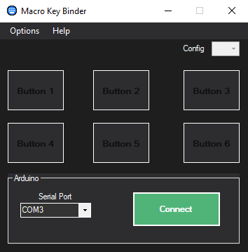
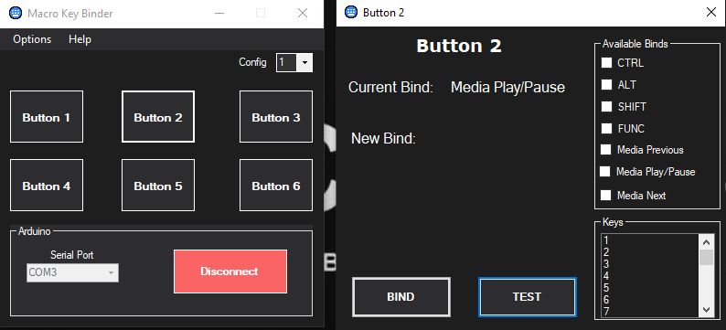

# Arduino Six-Key Macro Keyboard Project

This project features a rebindable six key macro keyboard powered by an Arduino (ATmega32u4). This project is still a work-in-progress. Anyone is welcome to branch off and modify this project to how they see fit. The Macro Key Binder is only supported in Windows only. There are no plans for a MacOS or Linux support. How ever you can still rebind keys through [Serial](#Serial-Command-Protocol). You may run into issues rebinding on MacOS since the firmware is written for non-Mac keys.

 

# TODO
- Support for all non-alpha and non-numerical keys.

 

# Installation
* [Arduino IDE](https://www.arduino.cc/en/software)
* [HID-Project Library for Arduino](https://github.com/NicoHood/HID)
* (Optional) [AutoHotKey](https://www.autohotkey.com/) - This can be used to run any programs or scripts you may want to launch.

 

# Macro Key Binder (Windows)

Developed in [.NET Framework 4.7.2](https://dotnet.microsoft.com/download/dotnet-framework/net472)

Current Features:
* Rebind Keys.
* Switch up to three different configs.
* Test binds from the app.

## [Download](https://github.com/Mesmaroth/Arduino-MacroKeyboard/releases)

 

# AutoHotKey
The Macro Key Binder only helps in rebinding keys or changing configs thus in order to run programs or scripts we need a program like AutoHotKey to be able to do this. Feel free to go over and edit the [AutoHotKey script](https://github.com/Mesmaroth/Arduino-MacroKeyboard/tree/main/Scripts) to customize your binds. There are no plans to implement application launching from within the Macro Key Binder.

# Arduino
## Default Configuration
Out the box the arduino has three configs with each having six binds for a total of 18 unique set of binds. Configs 1 and 2 are reversed for those that prefer the media keys to be at the bottom if your macro keyboard is arranged in 2 by 3 order. These binds were chosen so they wouldn't conflict with other apps hotkeys. Feel free to rebind them to however you want.

| Config   | Key 1 | Key 2 | Key 3 | Key 4 | Key 5 | Key 6 |
| ------   | ----- | ----- | ----- | ----- | ----- | ----- |
| Config 1 | Media Previous | Media Play/Pause | Media Next | CTRL+SHIFT+ALT+F5 | CTRL+SHIFT+ALT+F6 | CTRL+SHIFT+ALT+F7
| Config 2 | CTRL+SHIFT+ALT+F2 | CTRL+SHIFT+ALT+F3 | CTRL+SHIFT+ALT+F4 | Media Previous | Media Play/Pause | Media Next
| Config 3 | CTRL+SHIFT+ALT+F2 | CTRL+SHIFT+ALT+F3 | CTRL+SHIFT+ALT+F4 | CTRL+SHIFT+ALT+F5 | CTRL+SHIFT+ALT+F6 | CTRL+SHIFT+ALT+F7

 

# Serial Command Protocol
Examples: 
- `CTRL + SHIFT + ALT + F2` translates to `^+!F2`
- `Meda Play/Pause` translates to `#mplaypause`
- `CTRL + SHIFT + M` translates to `^+M`

## Keys
| Button | Symbol |
| ------ | -----  |
| CTRL 	 | ^	  |
| ALT 	 | ! 	  |
| SHIFT  | + 	  |
| F_NUM  | F#	  |

## Media
| Media | Protocol |
| ------ | -----  |
| Media Previous   | #mprev	  |
| Media Play/Pause | #mplaypause   |
| Media Next       | #mnext   |

## Buttons
| Button | Protocol |
| ------ | -------- |
| Button 1 | #bton> |
| Button 2 | #bttw> |
| Button 3 | #bttr> |
| Button 4 | #btfr> |
| Button 5 | #btfv> |
| Button 6 | #btsx> |

## Configs
| Config  | Protocol |
| ------   | -------- |
| Config 1 | #cfg1>    |
| Config 2 | #cfg2>    |
| Config 3 | #cfg3>    |

## Rebinds
| Rebind  | Protocol |
| ------ | -------- |
| Rebind Button 1 | #rbd1> |
| Rebind Button 2 | #rbd2> |
| Rebind Button 3 | #rbd3> |
| Rebind Button 4 | #rbd4> |
| Rebind Button 5 | #rbd5> |
| Rebind Button 6 | #rbd6> |

## For Testing
| CMD  | Protocol |
| ------ | -------- |
| Test Key | #test |
| Print All Configs | #pcfg> |
| Print Current Binds | #gcfg> |
| Print Current Config | #bcfg> |

